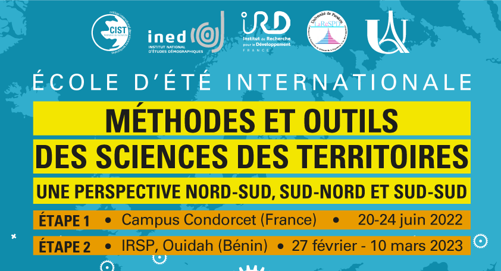

```{r setup, include=FALSE}
knitr::opts_chunk$set(echo = FALSE)

# Learn more about creating websites with Distill at:
# https://rstudio.github.io/distill/website.html

```

<br>

```{r echo=FALSE, out.width='100%'}

```

Blablabla...bla